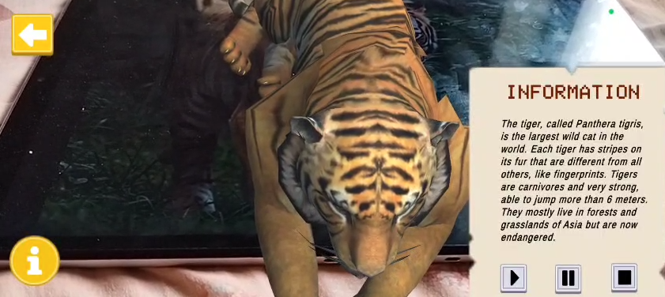

# 🪐 CurioSphere  
**An Interactive AR Experience with Unity + Vuforia**  


CurioSphere is an **Augmented Reality (AR)** project that recognizes real-world images and loads corresponding **3D models** with **audio narration** and **on-screen information**, creating an immersive learning and exploration experience.  

---

## 🚀 Features

- 🧠 **Image Recognition** – Detects target images using the **Vuforia Engine**.  
- 🧩 **3D Model Visualization** – Automatically loads and displays the correct **3D object** when an image is recognized.  
- 🔊 **Audio Narration** – Plays informative **voice-over or text-to-speech narration** for the recognized object.  
- 🖼️ **Informative Text Overlay** – Shows descriptive text or facts alongside the 3D model.  
- ⚡ **Cross-Platform Build** – Compatible with Android (via Unity build).  

---

## 🧰 Tech Stack

| Technology | Purpose |
|-------------|----------|
| **Unity Engine** | Game development & AR integration |
| **Vuforia Engine** | Image recognition & AR tracking |
| **C# (Unity Scripts)** | Core logic, event handling, and model control |
| **Blender / 3D Models** | 3D assets for AR visualization |
| **Text-to-Speech (TTS)** | Audio narration and information playback |

---

## 🏗️ How It Works

1. **Image Target Setup** – Add and train image targets in the Vuforia database.  
2. **Scene Configuration** – Link image targets with corresponding 3D models in Unity.  
3. **Scripting Logic** – Detect recognition events, trigger 3D model display, and play narration.  
4. **Deployment** – Build the project for Android or other supported platforms.  

---

## 📱 Demo Flow

1. Open the app.  
2. Point the camera toward a supported **image target**.  
3. Watch the **3D model appear** in augmented space.  
4. Hear the **audio narration** explaining what you see.  

---


---

## 🧩 Example Use Cases

- **Education** – Interactive textbooks that bring diagrams to life.  
- **Museums** – Exhibits that explain artifacts visually and audibly.  
- **Marketing** – AR product previews with narration.  
- **Kids Learning** – Fun and engaging way to explore animals, space, or history.  

---

## 🧑‍💻 Developer Setup

### Prerequisites
- Unity (Recommended Version: **2021.3+**)  
- Vuforia Engine SDK (via Unity Package Manager)  
- Android Build Support (for mobile builds)

### Installation
```bash
# Clone this repository
git clone https://github.com/MayankPatel0007/CurioSphere.git

# Open in Unity
# Configure Vuforia license key in Project Settings > XR > Vuforia

# Add your own image targets and 3D models
